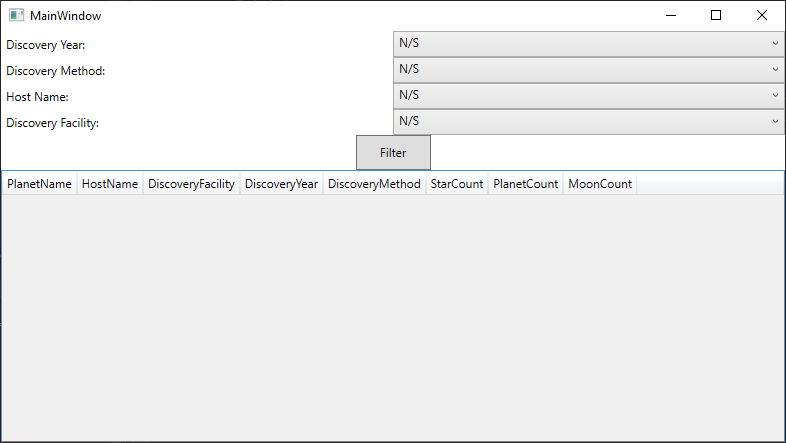

# nasa-exoplanet-query-app
Simple WPF application for that displays query results of the Planetary Systems table from the NASA Exoplanet Archive.



## Features
- Query the NASA Exoplanet Archive Planetary Systems table using the TAP (Table Access Protocol)
- Filter results by Discovery Year, Discovery Method, Host Name, and Discovery Facility
- Shows results of the query in a data grid, displaying the following information
    - Planet Name
    - Host Name
    - Discovery Facility
    - Discovery Year
    - Discovery Method
    - Star Count
    - Planet Count
    - Moon Count

## Requirements
- .NET 8.0 or later
- Visual Studio 2022
    ```
    Required Workloads
    - .NET desktop development
    - WinUI application development (for the Windows Application Package project)
    ```
- Internet connection (to enable API calls to the Exoplanet Archive Data Table)

## Installation

1. Clone the repository:
```
   git clone git@github.com:Lucsarge/nasa-exoplanet-query-app.git
```
2. Open `nasa-exoplanet-query-app.sln` in Visual Studio
3. Build and Run the nasa-exoplanet-query-app project

## Usage
1. The Comboboxes for each filter will get populated once the application launches
2. Use one or all of the comboboxes on the right to narrow results by:
    - Discovery year
    - Discovery method (Transit, Radial Velocity, etc.)
    - Host name (the name of the star that each exoplanet orbits)
    - Discovery facility
3. Click "Filter" to fetch data (warning: not selecting any drop down options will fetch the entirety of the database that )
4. Results appear in the main grid and update automatically as filters change (if no results appear it is either because no results matched your search parameters or less likely there was an issue with the http request)

## Data Source
- [Planetary Systems Data Table](https://exoplanetarchive.ipac.caltech.edu/cgi-bin/TblView/nph-tblView?app=ExoTbls&config=PS) - dataset for all ~39,443 that this application queries
- [Table Access Protocol doc](https://exoplanetarchive.ipac.caltech.edu/docs/TAP/usingTAP.html) - learning document that explains how the Table Access Protocol works, with some examples
- [Table Access Protocol (IVOA Recommendation)](https://www.ivoa.net/documents/TAP/20190927/REC-TAP-1.1.html) - full documentation on TAP capabilities (useful for understanding some limitations compared to full SQL)
- [Planetary Systems Definitions](https://exoplanetarchive.ipac.caltech.edu/docs/API_PS_columns.html)

## Miscellaneous Links
- [Trello Board](https://trello.com/b/4uqGBbif/nasa-exoplanet-query-app) - ticketing system I used to keep track of my work

## License
[License](LICENSE)
